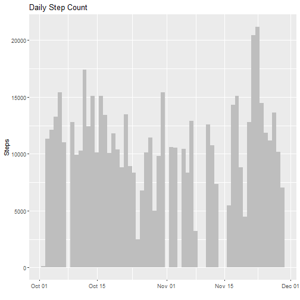
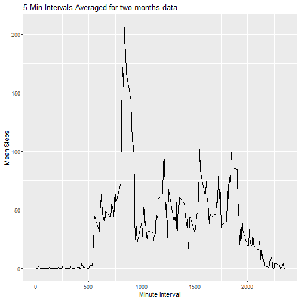
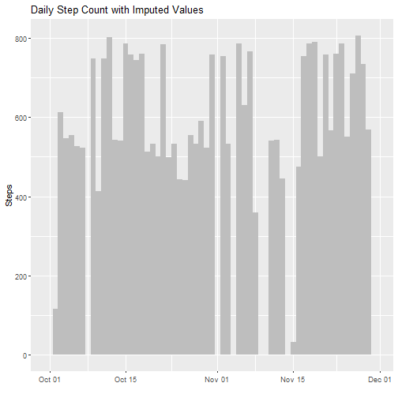
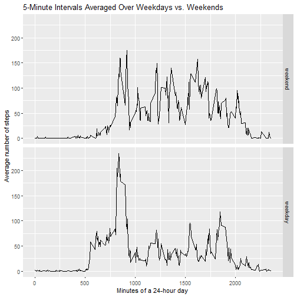

## Course Project 1 - Reproducible Research 

### Loading and Pre-processing the data

The first step of this project includes reading the files and assessing the data. The first part is done using the following code using read.csv function. 


```r
dataset <- read.csv("activity.csv")
```

Basic analysis of data is done using the following commands. It is important to see what percent of steps donot contain any value. The class of date column is also converted to date format.


```r
dim(dataset)
```

```
## [1] 17568     3
```

```r
names(dataset)
```

```
## [1] "steps"    "date"     "interval"
```

```r
summary(dataset)
```

```
##      steps            date              interval     
##  Min.   :  0.00   Length:17568       Min.   :   0.0  
##  1st Qu.:  0.00   Class :character   1st Qu.: 588.8  
##  Median :  0.00   Mode  :character   Median :1177.5  
##  Mean   : 37.38                      Mean   :1177.5  
##  3rd Qu.: 12.00                      3rd Qu.:1766.2  
##  Max.   :806.00                      Max.   :2355.0  
##  NA's   :2304
```

```r
mean(is.na(dataset$steps))
```

```
## [1] 0.1311475
```

```r
dataset$date <- as.Date(dataset$date)
```

### Making Average Steps / day Histogram
To make this graph, the steps are aggregated for each day using aggregate function, and then histogram is plotting using modified dataframe as the input.


```r
spd <- aggregate(cbind(dataset$steps)~dataset$date, data=dataset, sum, na.rm=TRUE)
colnames(spd)[1] <- "date"
colnames(spd)[2] <- "steps"
library(ggplot2)

ggplot(spd, aes(date, steps)) + 
        geom_col(width = 1, fill = "grey", 
                 position = "identity", na.rm = TRUE) + 
        labs(x = "", y = "Steps", title = "Daily Step Count")
```


The summary is given below: 

```r
summary(spd$steps)
```

```
##    Min. 1st Qu.  Median    Mean 3rd Qu.    Max. 
##      41    8841   10765   10766   13294   21194
```

To calculate the mean and median of total steps taken each day, aggregate function is used again, this time FUN= mean and median for mean and median calculations respectively. 


```r
stepmean <- aggregate(cbind(dataset$steps)~dataset$date+interval, data=dataset, FUN=mean, na.rm=TRUE)
avgmean <- aggregate(stepmean$V1~stepmean$interval, data=stepmean, FUN=mean)
stepmedian <- aggregate(cbind(dataset$steps)~dataset$date+interval, data=dataset, median, na.rm=TRUE)
avgmedian <- aggregate(stepmedian$V1~stepmedian$interval, data=stepmedian, FUN=median)
```
### Average Daily Activity Pattern
I am using line graph to illustrate average daily pattern for each 5 min interval. 


```r
colnames(avgmean)[1] <- "interval"
colnames(avgmean)[2] <- "steps"

ggplot(avgmean,aes(x=interval,y=steps))+geom_line()+
  ylab("Mean Steps")+xlab("Minute Interval")+
  ggtitle("5-Min Intervals Averaged for two months data")
```



To calculate the 5-minute interval that, on average, contains the maximum number of steps, I am converting the interval column is the dataset to a factor column. and then applying the aggregate function using mean and max as FUN. 


```r
#5-minute interval with the most steps
maxinterval <- subset(avgmean, 
                       avgmean$steps == max(avgmean$steps))
maxinterval
```

```
##     interval    steps
## 104      835 206.1698
```
### Imputing Missing Values
To find total number of rows containg NAs, this simple code is used. 

```r
sum(is.na(dataset$steps)=="TRUE")
```

```
## [1] 2304
```
To fill in these missing values I am using na.approx function from R that interpolates based on above and below values, which makes sense in this case too. 

```r
library(zoo)
dataset2 <- dataset
dataset2$steps <- as.integer(na.approx(dataset$steps, rule=2))
```
I am using aggregate function again based on dates to make the histogram. 

```r
nonas <- aggregate(data=dataset2,steps~date,FUN="sum")
colnames(nonas)[1] <- "date"
colnames(nonas)[2] <- "totalsteps"
nonas1 <- aggregate(cbind(dataset2$steps)~dataset2$date+interval, data=dataset2, FUN="mean")
nonasmean <- aggregate(nonas1$V1~nonas1$interval, data=nonas1, FUN=mean)
colnames(nonasmean)[1] <- "interval"
colnames(nonasmean)[2] <- "meansteps"
nonas2 <- aggregate(dataset2$steps~dataset2$date+interval, data=dataset2, FUN="median")
nonasmed <- aggregate(cbind(nonas2[,2])~nonas2$interval, data=nonas2, FUN=median)
colnames(nonasmed)[1] <- "interval"
colnames(nonasmed)[2] <- "median"

ggplot(dataset2, aes(date, steps)) + 
        geom_col(width = 1, fill = "grey", 
                 position = "identity", na.rm = TRUE) + 
        labs(x = "", y = "Steps", title = "Daily Step Count with Imputed Values")
```



```r
summary(avgmean)
```

```
##     interval          steps        
##  Min.   :   0.0   Min.   :  0.000  
##  1st Qu.: 588.8   1st Qu.:  2.486  
##  Median :1177.5   Median : 34.113  
##  Mean   :1177.5   Mean   : 37.383  
##  3rd Qu.:1766.2   3rd Qu.: 52.835  
##  Max.   :2355.0   Max.   :206.170
```

```r
summary(nonasmean)
```

```
##     interval        meansteps     
##  Min.   :   0.0   Min.   :  0.00  
##  1st Qu.: 588.8   1st Qu.:  2.16  
##  Median :1177.5   Median : 29.64  
##  Mean   :1177.5   Mean   : 32.48  
##  3rd Qu.:1766.2   3rd Qu.: 45.91  
##  Max.   :2355.0   Max.   :179.13
```

```r
summary(avgmedian)
```

```
##  stepmedian$interval stepmedian$V1   
##  Min.   :   0.0      Min.   : 0.000  
##  1st Qu.: 588.8      1st Qu.: 0.000  
##  Median :1177.5      Median : 0.000  
##  Mean   :1177.5      Mean   : 3.962  
##  3rd Qu.:1766.2      3rd Qu.: 0.000  
##  Max.   :2355.0      Max.   :60.000
```

```r
summary(nonasmed)
```

```
##     interval          median      
##  Min.   :   0.0   Min.   :   0.0  
##  1st Qu.: 588.8   1st Qu.: 588.8  
##  Median :1177.5   Median :1177.5  
##  Mean   :1177.5   Mean   :1177.5  
##  3rd Qu.:1766.2   3rd Qu.:1766.2  
##  Max.   :2355.0   Max.   :2355.0
```
After comparison of summaries it can be seen that mean has reduced overall after imputating the values. Average mean of steps for 5 minutes was 37 before imputing values and now it is 32.  

###Assessing Activity Patterns on Weekends and weekdays


```r
library(lubridate)
library(dplyr)
weekdays1 <- c('Monday', 'Tuesday', 'Wednesday','Thursday','Friday')
dataset$weekday <- factor((weekdays(dataset$date) %in% weekdays1) +1L, levels=1:2, labels= c('weekend','weekday'))

steps5min <- dataset%>% 
    group_by(weekday, interval) %>% 
    summarize(stepsAvg = mean(steps, na.rm=TRUE), 
              interval = unique(interval), 
              .groups = "drop_last")

#Producing panel plot
ggplot(steps5min, aes(interval, stepsAvg)) + 
        geom_line(col = "black") + 
        facet_grid(weekday ~ .) + 
        labs(x = "Minutes of a 24-hour day", 
             y = "Average number of steps",
             title = "5-Minute Intervals Averaged Over Weekdays vs. Weekends")
```


